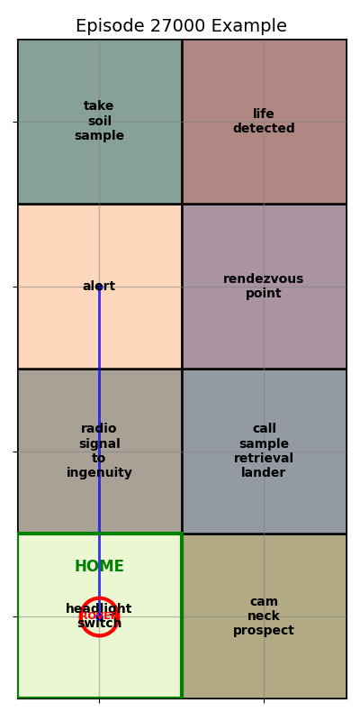

# Mars Micro Rover (Microver aka Roveo)

## Introduction

This Repository implements Deep Reinforcement Learning concepts like REINFORCE for training a rover to perform autonomous grid search tasks. At base-level the repository contains two examples.

🚀 Example 1: Simplified Objective for Grid-Based Rover Navigation

This example defines a basic objective: the rover must reach a designated safe point (exit_pos) in the shortest number of steps. The task is modeled as a Markov Decision Process (MDP) with the following components:

    State Space: All possible positions on a 2D terrain grid.

    Action Space: Movement directions—up, down, left, and right.

    Transition Model: Deterministic; each action moves the rover exactly one grid space in the chosen direction. Movement outside the grid boundaries is restricted.

    Reward Function: Each step incurs a penalty unless it leads directly to the objective, discouraging longer paths.

    Discount Factor: Enabled and configurable to prioritize shorter-term rewards.

    Partial Observability: The rover only receives partial information—its current position—at each step, making this setup more akin to a Partially Observable Markov Decision Process (POMDP).

🧠 Example 2: Real-World Rover Exploration with CircuitMess Perseverance

This scenario is designed for the Perseverance microrover by CircuitMess, which features a programmable ESP32 with an onboard camera. The rover can be programmed using MicroPython or by modifying the original C++ firmware.

The terrain is procedurally generated, with each grid section marked by an Aruco marker that encodes specific intelligence. The rover’s mission is to explore the Martian terrain in search of signs of life. Unknown to the rover, the terrain is structured with interdependencies between grid markers, creating a realistic flow of information that can hint at nearby life.

Key mechanics include:

    Objective: Discover life and return to the starting point before a simulated sandstorm hits.

    Rewards:

        For reaching grid points and avoiding alert zones.

        Greater rewards for discovering life and successfully returning home.

    Penalties:

        For entering alert zones (obstacles).

        Heavier penalties for failing to return before the sandstorm.

This setup encourages strategic exploration and inference, simulating a more intelligent and reactive rover behavior.
🧭 TL;DR:

    Example 1 is a classic sequential decision making problem with deterministic transitions and partial observability, focused on shortest-path navigation.

    Example 2 introduces real-world complexity using a programmable rover, Aruco markers, and a dynamic terrain with hidden dependencies, emphasizing exploration, inference, and survival under time constraints.

## Usage
- Each example has a runner. Simply run this file to train from scratch.

## Citing

## Results
| Early Rover Path Before Training Process | Rover Path Midway Throug Training Process|
| :-------------------------:|:-------------------------: |
|  |   |

| Rover Reward vs. Time  | Rover Ave Grids Explored Throughtout Training|
| :-------------------------:|:-------------------------: |
|  |   |

## Other Setup and dependencies

1. python3.11 -m venv {venv_name}
2. ./{venv_name}/Scripts/acitvate.bat
3. Ensure the environment is activated by checking 'where python' and pip list
    - these should only contain the basic python setup and python version
    - it should point to your local folder
    - If this is not working, switch to a bash terminal and run source full path to the environments activate file.
4. To install GPU enhanced torch follow these steps
    - pip install cuda-python
    - pip3 install --pre torch torchvision torchaudio --index-url https://download.pytorch.org/whl/nightly/cu121 (Note this is due to the fact that the torch has to line up with cuda to get the best GPU performance. At the time I am writing this cuda is at 12.2 and
      torch is at 12.1 support. Thus, I am using the latest nightly build rather than the stable version of torch)
5. You will need other packages to include but not limited to
    - numpy
    - pandas
    - matplotlib
