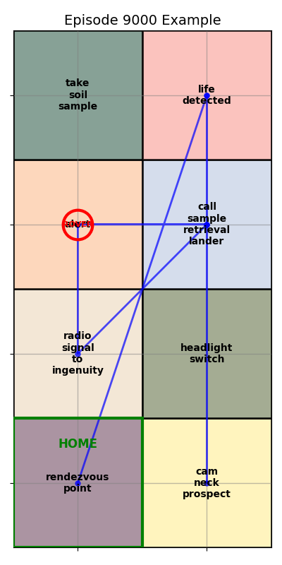
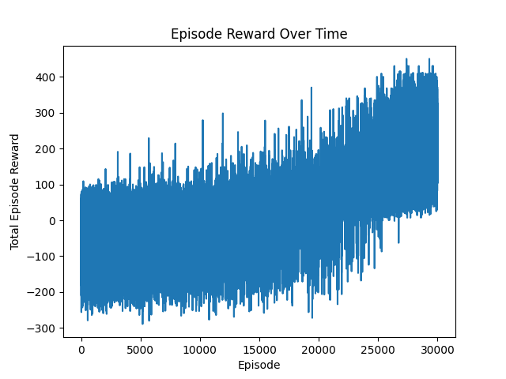
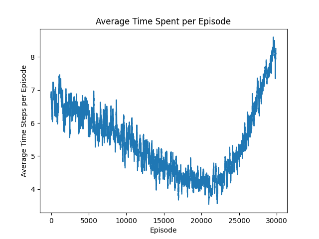

# Mars Micro Rover (Microver aka Roveo)

## Introduction

This Repository implements Deep Reinforcement Learning concepts like REINFORCE for training a rover to perform autonomous grid search tasks. At base level the repository contians two examples.

Example 1: The first example provides a simplified objective that instructs the rover to reach a safe point, labeled exit_pos, in the shortest amount of steps. As for the markov decision process:
    - the state is represented by all posible positions on a 2-dimensional terrain grid
    - the action space consists of different movement directions up, down, left, and right
    - the predictive model is deterministic and outlines a dynamic model such that the rover actions translate to a change in position by exactly one grid space in the selected action direction with constraints on moving outside the terrain grid
    - the reward penalizes each step that does not achieve the objective making longer paths less favorable
    - discount factor is enabled and configurable.
    - Note this is more a kin to POMDP since at each step the rover only receievs partial information consisting of its current position.

Example 2: Is intended to work with the actual Perseverance microrover by circuit mess. This rover has a programmable ESP32 with cam for it's onboard compute. This can programmed by a micropython project through Circuit Mess or the original C++ Firmware can be modified. With that said a terrain will be generated where each section of the terrain contains an Aruco marker that specifies different intelligence. The rovers goal is to search the Martian terrain for life by exploring different terrain grids. The rover is unaware that the Martian terrain is constructed in a way that creates dependencies between different grid markers, enabling a realistic flow that in theory allows the rover to pick up on cues that there is life nearby. The rover must find life and return home before the sandstorm hits. It is rewarded by reaching different grid points while avoiding alert areas, it is rewarded more for finding life and returning home. It is penalized for hitting obstacles (alerts) and moreso for not making it "home" before the sand storm.

## Usage
- Each example has a runner. Simply run this file to train from scratch.

## Citing

## Results
| Early Rover Path Before Training Process | Rover Path Midway Throug Training Process|
| :-------------------------:|:-------------------------: |
|  |   |

| Rover Reward vs. Time  | Rover Ave Grids Explored Throughtout Training|
| :-------------------------:|:-------------------------: |
|  |   |

## Other Setup and dependencies

1. python3.11 -m venv {venv_name}
2. ./{venv_name}/Scripts/acitvate.bat
3. ensure the environment is activated by checking 'where python' and pip list
    - these should only contain the basic python setup and python version
    - it should point to your local folder
    - if this is not working switch to bash terminal and run source full path to the environments activate file.
4. to install GPU enhanced torch follow these steps
    - pip install cuda-python
    - pip3 install --pre torch torchvision torchaudio --index-url https://download.pytorch.org/whl/nightly/cu121 (Note this is due to the fact that the torch has to line up with cuda to get best gpu performance. At the time I am writing this cuda is at 12.2 and
      torch is at 12.1 support. Thus I am using the latest nightly build rather than the stable version of torch)
5. You will need other packages to include but not limited to
    - numpy
    - pandas
    - matplotlib
